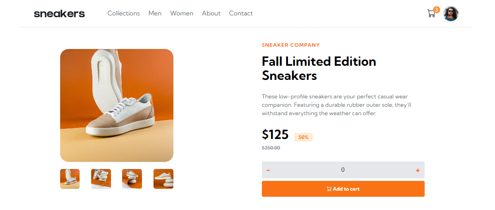
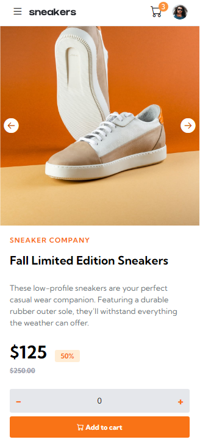

# Frontend Mentor - E-commerce product page solution

This is a solution to the [E-commerce product page challenge on Frontend Mentor](https://www.frontendmentor.io/challenges/ecommerce-product-page-UPsZ9MJp6). Frontend Mentor challenges help you improve your coding skills by building realistic projects.

## Table of contents

- [Frontend Mentor - E-commerce product page solution](#frontend-mentor---e-commerce-product-page-solution)
  - [Table of contents](#table-of-contents)
    - [Screenshot](#screenshot)
  - [My process](#my-process)
    - [Built with](#built-with)

### Screenshot

## My process

### Built with

- Semantic HTML5 markup
- Tailwind
- Vanilla JS
- Flexbox, Grid
- Mobile-first workflow
- Bootstrap icons
- Git version control
